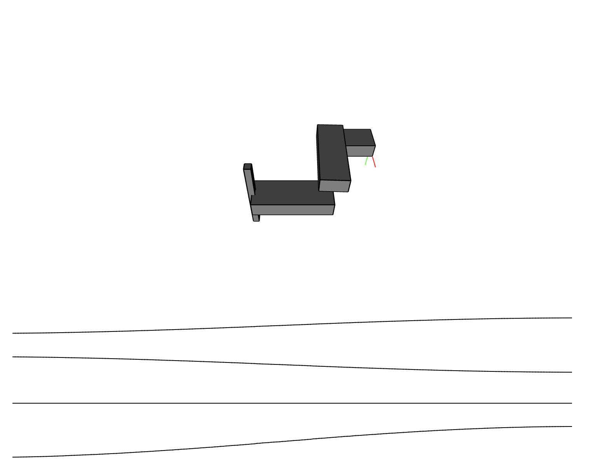

# roboticArm

This repository contains the files for visualization and controlling of a SCARA type robotic arm. 
It is recommended to open the repository in Visual Studio Code. The following steps allow an easy demo. 

- Add Live Server extension
- Click Go Live! and select the visu folder
- Run the input.py script

Now you should see the robot move in a sinusoidal pattern. The data is exchanged using the control.json file. 
To prevent the Live Server from continuously updating add the following line to the settings.json file of VS Code.
```json
"liveServer.settings.ignoreFiles":["control.json"],
```
A video of the running visualization can be found on my [YouTube Channel](https://youtu.be/5z7kV3Y0rQM).


